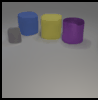
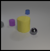
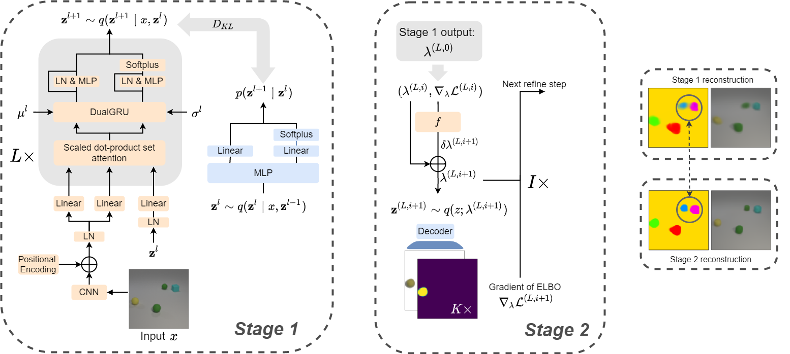

</img>
</img>
</img>
</img>

# EfficientMORL

Official implementation of our ICML'21 paper "Efficient Iterative Amortized Inference for Learning Symmetric and Disentangled Multi-object Representations" [Link](http://proceedings.mlr.press/v139/emami21a.html). 

[Watch our YouTube explainer video](https://youtu.be/4SDXQxBu_D8)

### 30,000 feet

The motivation of this work is to design a deep generative model for learning high-quality representations of multi-object scenes. Generally speaking, we want a model that 
 1) Can infer object-centric latent scene representations (i.e., slots) that share a *common format*
 2) Can infer *unordered* slots (permutation equivariance)
 3) Can infer *disentangled* slots
 4) Is *efficient* to train and use at test time

To achieve efficiency, the key ideas were to cast iterative assignment of pixels to slots as bottom-up inference in a multi-layer **hierarchical variational autoencoder (HVAE)**, and to use a few steps of low-dimensional iterative amortized inference to refine the HVAE's approximate posterior. We found that the two-stage inference design is particularly important for helping the model to avoid converging to poor local minima early during training.

</img>

See the [paper](http://proceedings.mlr.press/v139/emami21a.html) for more details.

## Installation

Install dependencies using the provided conda environment file:

```bash
$ conda env create -f environment.yml
```

To install the conda environment in a desired directory, add a prefix to the environment file first.

For example, add this line to the end of the environment file: `prefix: /home/{YOUR_USERNAME}/.conda/envs`

## Multi-Object Datasets

A zip file containing the datasets used in this paper can be downloaded from [here](http://doi.org/10.5281/zenodo.4895643). 

These are processed versions of the tfrecord files available at [Multi-Object Datasets](https://github.com/deepmind/multi_object_datasets) in an .h5 format suitable for PyTorch.
See `lib/datasets.py` for how they are used.
They are already split into training/test sets and contain the necessary ground truth for evaluation.
Unzipped, the total size is about 56 GB.
Store the .h5 files in your desired location.

Please cite the original repo if you use this benchmark in your work:

```
@misc{multiobjectdatasets19,
  title={Multi-Object Datasets},
  author={Kabra, Rishabh and Burgess, Chris and Matthey, Loic and
          Kaufman, Raphael Lopez and Greff, Klaus and Reynolds, Malcolm and
          Lerchner, Alexander},
  howpublished={https://github.com/deepmind/multi-object-datasets/},
  year={2019}
}
```

## Training

We use `sacred` for experiment and hyperparameter management. 
All hyperparameters for each model and dataset are organized in JSON files in `./configs`. 

### Tetrominoes example
We recommend starting out getting familiar with this repo by training EfficientMORL on the Tetrominoes dataset.
It can finish training in a few hours with 1-2 GPUs and converges relatively quickly.

Inspect the model hyperparameters we use in `./configs/train/tetrominoes/EMORL.json`. 
Note that `Net.stochastic_layers` is `L` in the paper and `training.refinement_curriculum` is `I` in the paper.
 

Then, go to `./scripts` and edit `train.sh`. Provide values for the following variables:

```bash
NUM_GPUS=#Set to however many GPUs you have available
SEED=#The desired random seed for this training run
DDP_PORT=#The port number for torch.distributed, can be left to default
ENV=tetrominoes
MODEL=EMORL
DATA_PATH=#Set to the absolute path of the folder where the unzipped .h5 files are
BATCH_SIZE=#Set to 32 / NUM_GPUS
OUT_DIR=#Set to the absolute path of the folder where you will save tensorboard files, model weights, and (optionally) sacred runs
```

Start training:

```bash
$ ./train.sh
```

Monitor loss curves and visualize RGB components/masks:

```bash
$ tensorboard --logdir $OUT_DIR/tb
```

and open in your browser.

#### Pre-trained Tetrominoes model

If you would like to skip training and just play around with a pre-trained model, we provide the following set of pre-trained weights in `./examples`:

| checkpoint | ARI | MSE | KL | wall clock training | hardware | 
| --- | --- | --- | --- | --- | --- | 
| emorl-tetrominoes-seed-1200-state-200000.pth | 99.7 | 2.76 x 10^-4 | 70.7 | 5 hrs 2 min | 2x Geforce RTX 2080Ti |

### On using GECO for stabilizing training

We found that on Tetrominoes and CLEVR in the Multi-Object Datasets benchmark, using [GECO](https://arxiv.org/abs/1810.00597) was necessary to stabilize training across random seeds and improve sample efficiency (in addition to using a few steps of lightweight iterative amortized inference).

GECO is an excellent optimization tool for "taming" VAEs that helps with two key aspects:
1. **Dynamically adjusts a hyperparameter that trades off the reconstruction and KL losses**, which improves training robustness to poor weight initializations from a "bad" random seed. The automatic schedule initially *increases* the relative weight of the reconstruction term to encourage the model to first achieve a high-quality image reconstruction. Following this, the relative weighting of the reconstruction term is *decreased* to minimize the KL.
2. **Reduces variance** in the gradients of the ELBO by minimizing the distance of an exponential moving average (EMA) of the reconstruction error to a pre-specified target reconstruction error (an easier constrained minimization), instead of trying to directly minimize the error (a harder unconstrained minimization). Lower variance results in faster convergence.

The caveat is we have to specify the desired reconstruction target for each dataset, which depends on the image resolution and image likelihood. 
Here are the hyperparameters we used for this paper:

| dataset | resolution | image likelihood | global std dev | GECO reconstruction target | 
| ---     | ---  | --- | ---                 | --- |
| Tetrominoes | 35 x 35 |  Gaussian       | 0.3 | -4500 (-1.224) | 
| CLEVR6      | 96 x 96 |  Mixture of Gaussians | 0.1 |  -61000 (-2.206) |

We show the per-pixel and per-channel reconstruction target in paranthesis. Note that we optimize unnormalized image likelihoods, which is why the values are negative.
We found GECO wasn't needed for Multi-dSprites to achieve stable convergence across many random seeds and a good trade-off of reconstruction and KL. 

**Choosing the reconstruction target:** I have come up with the following heuristic to quickly set the reconstruction target for a new dataset without investing much effort:
1. Choose a random initial value somewhere in the ballpark of where the reconstruction error should be (e.g., for CLEVR6 128 x 128, we may guess -96000 at first).
2. Start training and monitor the reconstruction error (e.g., in Tensorboard) for the first 10-20% of training steps. EMORL (and any pixel-based object-centric generative model) will in general learn to reconstruct the background first. This accounts for a large amount of the reconstruction error.
3. Stop training, and adjust the reconstruction target so that the reconstruction error achieves the target after 10-20% of the training steps. This will reduce variance since `target - EMA(recon_error)` goes to 0 and allows GECO to gently increase its Lagrange parameter until foreground objects are discovered. The target should ideally be set to the reconstruction error achieved *after* foreground objects are discovered.
4. Once foreground objects are discovered, the EMA of the reconstruction error should be lower than the target (in Tensorboard, `geco_C_ema` will be a positive value, which is `target - EMA(recon_error)`). Once this is positive, the GECO Lagrange parameter will decrease back to 1. This is important so that the model estimates a proper ELBO at the end of training.

### Model variants & hyperparameters

| Parameter | Usage | 
| ----------- | ----------- |
| Net.K | The number of object-centric latents (i.e., slots) |
| Net.image_likelihood | "GMM" is the Mixture of Gaussians, "Gaussian" is the deteriministic mixture |
| Net.z_size | Number of dimensions in each latent |
| Net.image_decoder | "iodine" is the (memory-intensive) decoder from the IODINE paper, "big" is Slot Attention's memory-efficient deconvolutional decoder, and "small" is Slot Attention's tiny decoder |
| Net.stochastic_layers | Number of layers in the HVAE (`L`) |
| Net.log_scale | ln(std_dev) used in the image likelihood |
| Net.bottom_up_prior | Train EMORL w/ BU prior (Default false) |
| Net.reverse_prior_plusplus | Trains EMORL w/ reversed prior++ (Default true), if false trains w/ reversed prior |
| Net.use_DualGRU | Use the DualGRU (Default true) |
| training.kl_beta_init | Set $\beta$-VAE parameter, we leave at 1 |
| training.use_geco | Enable/disable using GECO |
| training.use_scheduler | Enable/disable LR warmup |
| training.clip_grad_norm | Enable/disable grad norm clipping to 5.0 |
| training.iters | Number of train gradient steps to take | 
| training.refinement_curriculum | Tuple [`step`, `I`] means for every gradient step beyond `step` use `I` refinement iters |
| training.load_from_checkpoint | Set to `true` if resuming training |
| training.checkpoint | The .pth filename for resuming training |
| training.tqdm | Enable/disable tqdm in the CLI |

Some other config parameters are omitted which are self-explanatory.

## Evaluation

Go to `./scripts`. Open `eval.sh` for editing and update the following variables:

```bash
DATA_PATH=#Set to the absolute path of the folder where the unzipped .h5 files are
OUT_DIR=#Set to the absolute path of the folder where you will save eval results in, probably same path set for training
CHECKPOINT=#Set to the name of the .pth file saved in the `weights` directory in $OUT_DIR
```

 After setting the other variables depending on the desired metric (see below), run the script:

```bash
$ ./eval.sh
```


### ARI, MSE, KL

In `eval.sh`, edit the following variables: 

```bash
ENV=tetrominoes # or clevr6, multi_dsprites
JSON_FILE=EMORL
EVAL_TYPE=ARI_MSE_KL
```

Results will be stored in files `ARI.txt`, `MSE.txt` and `KL.txt` in folder `$OUT_DIR/results/{test.experiment_name}/$CHECKPOINT-seed=$SEED`

### CLEVR6 disentanglement

To compute activeness and make visualizations, you have to do one step of pre-processing first.

#### Disentanglement preprocessing

Will create a file storing the min/max of the latent dims of the trained model, which helps with running the activeness metric and visualization.

In `eval.sh`, edit the following variables:

```bash
ENV=clevr6
JSON_FILE=EMORL_preprocessing
EVAL_TYPE=disentanglement
```

#### Activeness

In `eval.sh`, edit the following variables:

```bash
ENV=clevr6
JSON_FILE=EMORL_activeness
EVAL_TYPE=disentanglement
```

An array of the variance values `activeness.npy` will be stored in folder `$OUT_DIR/results/{test.experiment_name}/$CHECKPOINT-seed=$SEED`

#### DCI

In `eval.sh`, edit the following variables:

```bash
ENV=clevr6
JSON_FILE=EMORL_dci
EVAL_TYPE=disentanglement
```
Results will be stored in a file `dci.txt` in folder `$OUT_DIR/results/{test.experiment_name}/$CHECKPOINT-seed=$SEED`

### Visualizing slots

In `eval.sh`, edit the following variables:

```bash
ENV=clevr6 # or tetrominoes, multi_dsprites
JSON_FILE=EMORL
EVAL_TYPE=sample_viz
```
Results will be stored in a file `rinfo_{i}.pkl` in folder `$OUT_DIR/results/{test.experiment_name}/$CHECKPOINT-seed=$SEED` where `i` is the sample index

See `./notebooks/demo.ipynb` for the code used to generate figures like Figure 6 in the paper using `rinfo_{i}.pkl`


## Citation

```
@InProceedings{pmlr-v139-emami21a,
  title = 	 {Efficient Iterative Amortized Inference for Learning Symmetric and Disentangled Multi-Object Representations},
  author =       {Emami, Patrick and He, Pan and Ranka, Sanjay and Rangarajan, Anand},
  booktitle = 	 {Proceedings of the 38th International Conference on Machine Learning},
  pages = 	 {2970--2981},
  year = 	 {2021},
  editor = 	 {Meila, Marina and Zhang, Tong},
  volume = 	 {139},
  series = 	 {Proceedings of Machine Learning Research},
  month = 	 {18--24 Jul},
  publisher =    {PMLR},
  url = 	 {http://proceedings.mlr.press/v139/emami21a.html},
}

```
